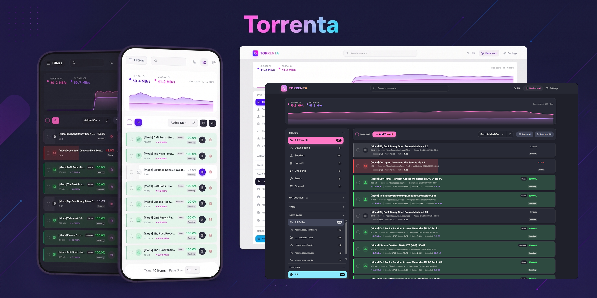

# 🚀 Torrenta - 高颜值 qBittorrent WebUI 客户端

<div align="center">
  
  <p><b>高颜值、响应式、轻量级的 qBittorrent WebUI 客户端</b></p>
  <p>支持 <b>qBittorrent</b> (HTTP API v2) 深度整合，带来如丝般顺滑的现代化种子管理面板。</p>
  <p>
    <a href="README.md"><b>English README</b></a> |
    <a href="doc/user_manual_zh.md"><b>📖 官方安装与使用手册</b></a> |
    <a href="#-💡-快速开始"><b>⚡ 快速开始</b></a>
  </p>
</div>

---

## 🌟 核心特性 (Key Features)

- **✨ 极简高级设计**：基于 Vue 3 + Tailwind CSS + DaisyUI 构建，采用现代卡片式布局与优雅微动画，适配深色/浅色模式，多语言原生支持。
- **📊 实时遥测图表**：内置高性能 SVG 实时双向速度图表，直观展示全局上传/下载流量波动。
- **⚡ 高性能非阻塞**：采用精细化的高频非阻塞递归轮询机制，相比传统 WebUI 更低延迟、极低系统资源占用。
- **📱 完美移动端支持**：所有菜单与操作面板均经过移动端专门适配，手机或平板操作得心应手。
- **🔒 零配置代理整合**：内置 Nginx 多种端口自适应规则，支持 Host/Origin 请求头自动重写，规避浏览器 CORS 及 SameSite 拦截保护。

---

## 🛠️ 技术栈 (Tech Stack)

*   **框架**：Vue 3 (Composition API / SFC)
*   **状态管理**：Pinia
*   **网络请求**：Axios
*   **样式体系**：Tailwind CSS + DaisyUI v4
*   **图标集**：Lucide Vue Next
*   **运行环境**：Node 20+ / Docker (Nginx Alpine)

---

## ⚡ 💡 快速开始 (Quick Start)

这里是极简启动指南。如需查看完整的 **CORS 跨域排错**、**本地备用 WebUI 安装** 或 **定时自动更新脚本配置**，请参阅 👉 **[详细安装与使用手册](doc/user_manual_zh.md)**。

### 🚀 飞牛私有云 fnOS 原生应用安装（推荐）

Torrenta 现已全面支持 **飞牛私有云 (fnOS)** 原生 FPK 应用包格式，无需配置繁琐的 Docker 参数，即可在应用中心一键离线安装与管理。

1. **下载安装包**：前往 [Releases 页面](https://github.com/fulcoo/Torrenta/releases) 下载最新版本的 `torrenta-x.x.x.fpk`。
2. **离线安装**：
   - 登录飞牛 fnOS 桌面，打开 **应用中心** -> 点击右上角 **安装** / **手动安装**。
   - 选择下载的 `.fpk` 文件并上传。
   - 在弹出的**图形化安装向导**中，按需设置 Torrenta 访问端口（默认: `18322`）以及 qBittorrent 端口（默认: `8080`）。
3. **安全与最小权限**：
   - Torrenta 严格遵循 Linux/fnOS **最小权限安全规范**（`run-as: package`），作为无特权的隔离沙盒用户运行，绝不索取 NAS 的 `root` 最高权限。
4. **即点即用**：安装完成后，飞牛桌面将自动生成 Torrenta 图标，点击即可直接进入现代化管理面板！

> 💡 **开发者打包**：项目根目录执行 `npm run build:fpk`，即可全自动完成图标生成、前端编译与 FPK 打包（产物位于 `release/` 目录）。

---

### ⚙️ qBittorrent 服务端配置说明 (关键)

#### 方案 A：远程一键自动脚本（推荐，免手动修改）
在飞牛 NAS 或 Linux 终端中执行以下一键命令，脚本将自动定位 qBittorrent 容器、判断是否已配置、备份旧配置、安全注入参数并自动重启：

```bash
# 官方源执行：
bash <(curl -sSL https://raw.githubusercontent.com/fulcoo/Torrenta/main/scripts/auto_config_qb.sh)

# 国内加速源执行：
bash <(curl -sSL https://ghproxy.net/https://raw.githubusercontent.com/fulcoo/Torrenta/main/scripts/auto_config_qb.sh)
```
> 💡 **智能幂等设计**：若您已经手动或曾经配置过，脚本会自动识别并提示 `已包含免密与反向代理放行配置，无需重复修改`，绝不重复重启或误改。

#### 方案 B：手动修改配置文件
向您的 `qBittorrent.conf` 的 `[Preferences]` 段落中添加如下配置（如 Docker 部署，在挂载的 `config/qBittorrent/qBittorrent.conf` 中修改）：

```ini
[Preferences]
WebUI\HostHeaderValidation=false
WebUI\CSRFProtection=false
WebUI\LocalHostAuth=false
WebUI\AuthSubnetWhitelistEnabled=true
WebUI\AuthSubnetWhitelist=127.0.0.1/32, 192.168.0.0/16, 10.0.0.0/8, 172.16.0.0/12
```

> 💡 **参数作用**：
> * `WebUI\HostHeaderValidation=false` 与 `WebUI\CSRFProtection=false`：彻底解除跨域与域名标头拦截，使 NPM、网关或 Torrenta 本地反向代理能顺畅通信，杜绝 401 Unauthorized 报错。
> * `WebUI\LocalHostAuth=false`：**允许 127.0.0.1 本地回环免密登录**。由于 Torrenta 运行在飞牛本地并通过代理与 qB 通信，开启后无需反复查找 qB 5.x 的动态临时密码。
>
> ⚠️ **手动修改注意**：手动修改 `qBittorrent.conf` 前**必须先停止 qBittorrent 容器/服务**（如 `docker stop <容器名>`），修改保存后再启动；若在运行中直接修改，qBittorrent 退出时会用内存数据覆盖文件导致修改丢失。

---

### 🐳 使用 Docker 运行

目前您可以直接拉取 Docker Hub 上的官方编译镜像 **`fulcoo/torrenta:latest`** 来进行快速部署。

#### 方案一：Docker Run 命令行启动（最快）
```bash
docker run -d \
  --name torrenta \
  -p 3000:80 \
  -e QBITTORRENT_URL=http://<您的qBittorrent-IP>:<您的qBittorrent端口，默认8080> \
  -e QBITTORRENT_HOST=<您的qBittorrent-IP>:<您的qBittorrent端口，默认8080> \
  --restart unless-stopped \
  fulcoo/torrenta:latest
```

#### 方案二：Docker Compose 启动
1. 确认您已有一个正在运行的 qBittorrent。
2. 项目中内置的 [docker-compose.yml](docker-compose.yml) 已经默认配置为拉取官方镜像 `fulcoo/torrenta:latest`。编辑该文件配置环境变量：
   ```yaml
   environment:
     QBITTORRENT_URL: "http://host.docker.internal:<您的qBittorrent端口，默认8080>"  # qBittorrent 的 WebUI 访问地址
     QBITTORRENT_HOST: "localhost:<您的qBittorrent端口，默认8080>"                  # qBittorrent 期待的主机标头 (Host)
   ```
3. 在终端中启动：
   ```bash
   docker compose up -d
   ```
4. 在浏览器中访问 `http://localhost:3000` 即可开始使用！

---

### 📂 备用 WebUI 编译模式

1. 运行编译命令：
   ```bash
   npm install
   npm run build
   ```
2. 将生成的整个 `dist/` 文件夹复制到您的 qBittorrent 服务器。
3. 打开 qBittorrent 的设置（Web UI），启用“使用备用 Web UI”，指向该 `dist/` 文件夹的路径（包含 `public` 的父目录）。
4. 刷新网页即可。

---

## 🔄 自动更新 (Auto Updates)

- **Docker 容器**：在 `docker-compose.yml` 中启动 `watchtower` 实现容器自动检测并无缝拉取最新版本；或者定期运行 `docker compose pull && docker compose up -d`。
- **备选 WebUI**：使用本项目提供的 [update-torrenta.sh](update-torrenta.sh) 自动化更新脚本，只需配合 Cron 即可每日自动拉取 GitHub 上的最新 Release 静态包并进行覆盖更新。

---

## 📄 开源协议 (License)

本项目基于 MIT 协议开源。
